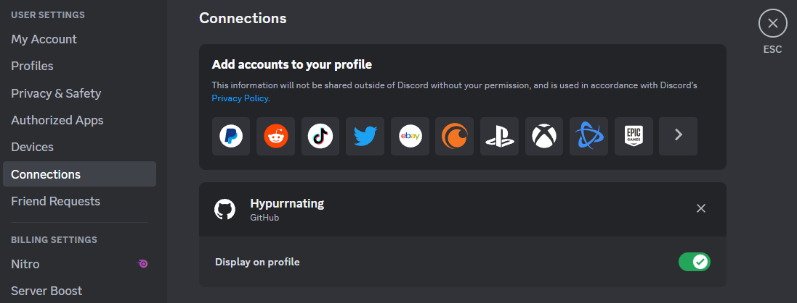

# Failed

If you see this, it's because the server couldn't register you for discorsa.\
Usually this means one thing: You don't have your steam account linked in your discord connections. You can read about that on the [official Discord blogpost](https://support.discord.com/hc/en-us/articles/8063233404823-Connections-Linked-Roles-Community-Members#h_01GK285ENTCX37J9PYCM1ADXCH), or just follow the instructions below.

FYI, this is the safest way to verify you.

### How to connect your steam account

- Go to your discord user settings, and find the `connections` tab.\
It should look something like this:\

- Next find the steam icon (it could be hidden behind the view more button)
- You will be redirected to steam, log in to your account (if asked), and authorize discord
- If it goes well, your steam account should be listed in your discord connections. If you want you can hide it from your profile

[![Register Button]][Register Link]

[Register Link]: https://discord.com/api/oauth2/authorize?client_id=1111709452526161920&redirect_uri=https%3A%2F%2Fdiscorsa-webserver-endpoint.up.railway.app%2Fo2auth&response_type=code&scope=identify%20connections
[Register Button]: https://img.shields.io/badge/Register_for_discorsa_again-70128f?style=for-the-badge

[![Server Button]][Server Link]

[Server Link]: https://discord.gg/DPTCrxawBx
[Server Button]: https://img.shields.io/badge/Join_support_server-5865F2?style=for-the-badge